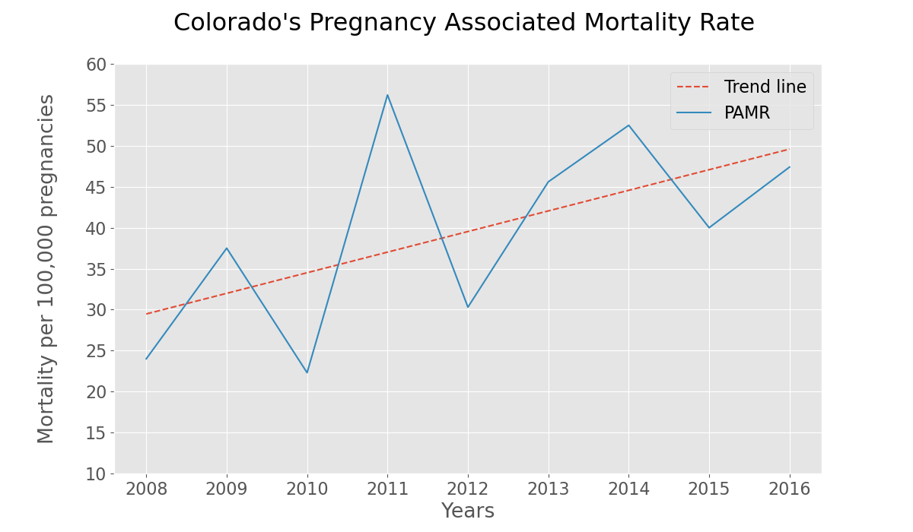
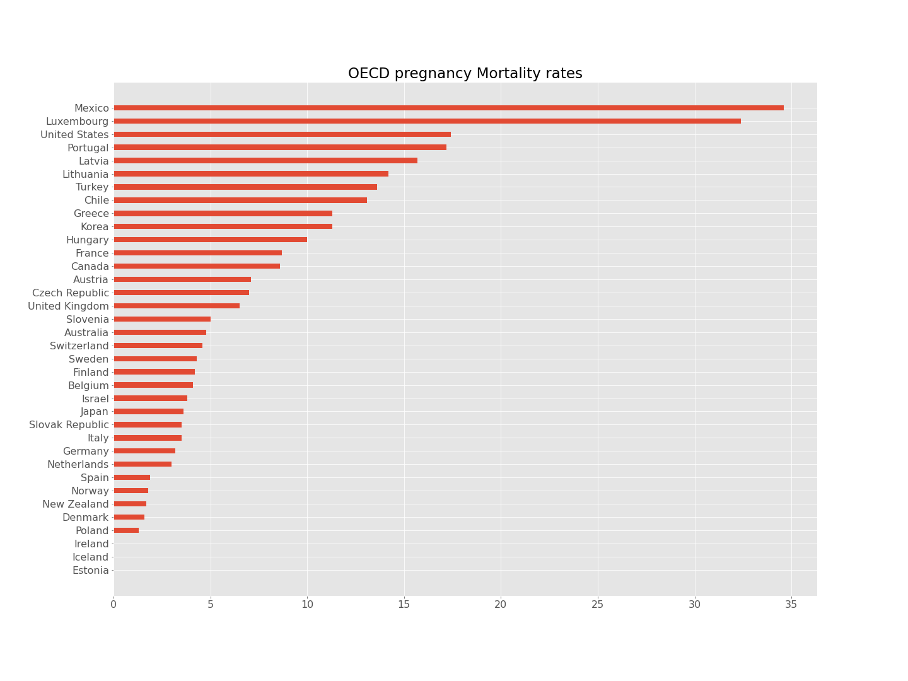
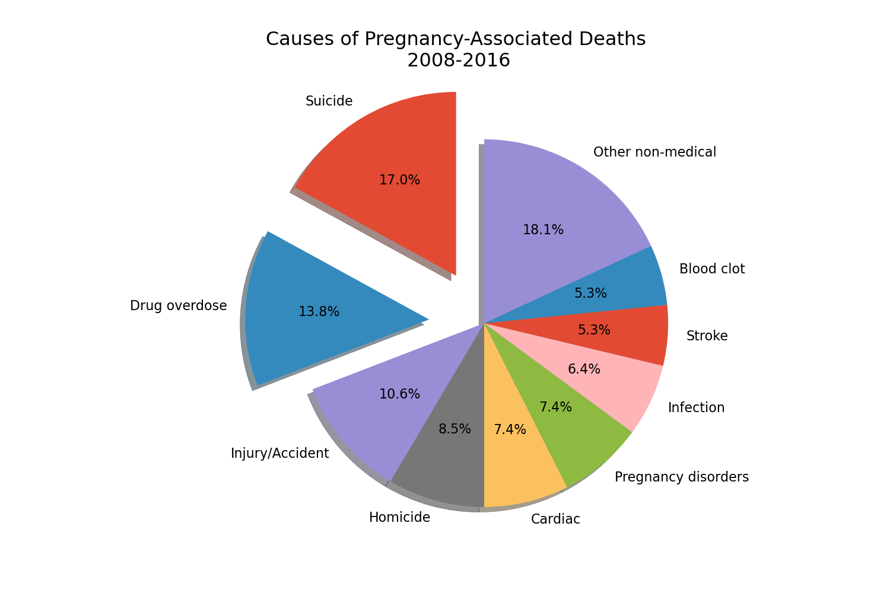
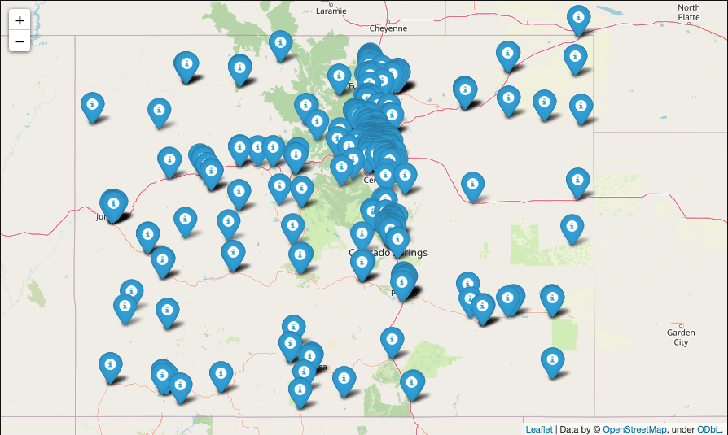
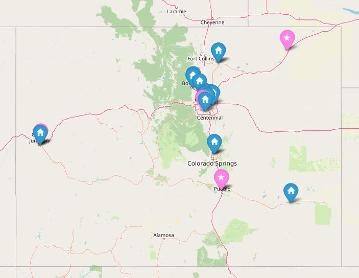
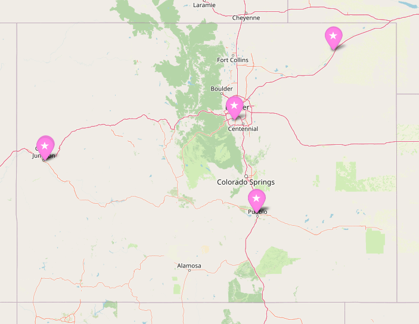

Capstone1: 
# Exploring ways to reduce Colorado's pregnancy mortality rate

In December 2017, my wife and I helped a pregnant women struggling with substance abuse through her last trimester.  We adopted our youngest son, Theodore, from her through what is called direct placement adoption.  During those three months we learned first hand the challenges pregnant women struggling with substance abuse face.  She was malnourished, financially insecure, depressed and under physical duress.  She had a lot to escape from and methamphetamemes are cheap but highly addictive.  On her first prenatal visit she learned the extensive risk her baby was in and became suicidal.  The only place nearby that would take a suicadal, drug addicted, high risk pregnant women was the emergency room.  However, she still had another two months to go before she gave birth.  Ultimately, we were able to find a substance abuse treatment facility that would put her through a two week detox program.  The facility was over two hours away which made visits too difficult for us.  Through the help of another family we were able to find a trailer home and a part time job in a safer part of town when she got out of the facility. Her challenges are not uncommon as around 27 expecting or new mothers pass away from pregnancy associated issues in Colorado every year.

# Explaining the metrics:
* Pregnancy Associated Mortality Rate (PAMR) -  is the rate of mortality from pregnancy to a year after birth per 100,000 births used in Colorado.

* Pregnancy Mortality Rate or Maternal Mortality Rate - is the rate of mortality from pregnancy to 41 days after birth per 100,0000 births and is commonly used internationally.

Colorado PAMR is shown below as 47 deaths/100,000 births in 2016.  Nationally, Colorado has the fifth lowest pregnancy mortality rate of 11.4 compared to Louisiana's 58.1 which is the worst in the nation.

 

Unfortunatly, the United States is 34th out of 36th amongst OECD countries world health's "Maternal Mortality Rate" which counts mortalities during pregnancy and up to 41 days after birth.  Colorado's "Maternal Mortality rate" would put Colorado about even with Greece and Chile.

 

Colorado University Anschutz Medical Campus conducted the studies shown above that encompassed 94 pregnancy-associated deaths from 2008-2016 which found 30% (29 out of 94) of pregnancy associated deaths were due to overdose and suicide.  In this study the suicides by drug overdose was categorized in the suicide category which is why its highlighted along with drug overdose in the chart below.

 

So this brings us to our question: 

# What is Colorado doing to help pregnant women with substance abuse issues, and, more importantly, how can Colorado improve on what it is currently doing?

We will address the problem first from a top down perspective:

## Governance: 
The Colorado "Maternal Mortality Review Committee' (MMRC) started meeting in 1993 but wasn't made official by the state until 2018 becoming the 41st state to do so. The MMRC holds regular meetings, commissions studies and regularly reviews the efficacy of Colorado initiatives to reduce this the growing pregnancy mortality rate.
## Funding: 
For over forty years Colorado has had a special medicaid funding program called "Special Connections" which provide up to 12 months of residential substance abuse treatment for expecting and recent mothers.

## Data collection:
Colorado health department tracks "Substance Abuse Providers", "Provider Shortages" and "Drug Overdose Deaths."  We will focus our analysis on the Substance Abuse and Mental Health Service Providers (SAMSHA) data set.
https://data-cdphe.opendata.arcgis.com/datasets/samhsa-colorado-substance-abuse-and-mental-health-service-providers

The dataset is 506 rows by 41 columns and does have standardized categorical values.

* Of the 506 Substance Abuse and Mental Health service providers 60% of the facilities are listed under the generic term Substance Abuse Treatment compared to the roughly 200 facilities which provide a more detailed description of services.

* Roughly 70% of the facilities do not have listed facility type to address if they are a hospital, outpatient clinic, residential treatment, or a psychiatric unit.

* The biggest glaring gap in the data set was the lack of information on number of beds or patient capacity per facility. The last data on beds I could find information on SAMSHA bed counts was a report in 2012 which is most likely outdated by now.

* Lastly, the dataset didn't have all the "Special Connections Facilities" which had to be ported into the dataset.

## Care Facilities:
Colorado has over 506 different treatment facilities listed in the SAMHSA database. The different categorial types are listed below showing the showing the different types of treatment but also illustrates how much a consumer has to learn about the space in order to appropriately select the treatment facility of best fit.

 

The facilities as a whole provide a very good amount of treatment covereage across the state.

 

However, once you narrow down the type of care a drug addicted pregnant women needs the opportunities are much less:
* 20 Transitional Housing Substance abuse facilities
* less 4 facilities that dont treat opoid addiction or don't use medication to treat addictions
* 16 remaining facilities for Colorado's addicted pregnant mothers

 

With the right guidance one can find the path to a "Special Connections" facility whose addresses aren't publicly listed: 
* They require a formal application process
* Have a waiting list.  
* Routinely serve between 150-200 patients a year
* They are experiancing a growing demand and as the front range population continues to grow more facilities may need to be brought into this program.

 

# Bottom up review

## User Experiance at the top of the Funnel

As a drug addicted pregnant women navigating life is difficult enough. Now they have to navigate the intersection of medical care, medicaid and mental healthcare to get help for their addiction.  Whenever they search on Google the page is dominated by scary stories, academic or medical journals or "hotline" phone numbers. 

 

Part II of this project will review the efficacy of the following in order to help make the first step to getting treatment a little bit easier.:
* SEO
* PPC
* A/B testing
* website chatbots 