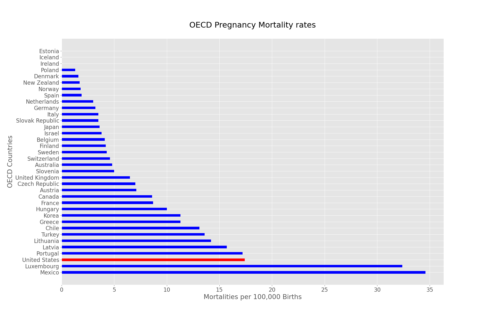

# Capstone1: Exploring ways to reduce CO Pregnancy Mortality rate

Colorado loses about 27 expecting or recent mothers each year.  The metric to track this in Colorado is called the Pregnancy Associated Mortality Rate or PAMR. The PAMR is calculate per 100,000 births and currently Colorado is the fifth lowest in the nation.

 

Unfortunatly, the United States is 34th out of 36th amongst OECD countries world health's "Maternal Mortality Rate" which counts mortalities during pregnancy and up to 41 days after birth.  Colorado's "Maternal Mortality rate" is 11.4 which would put Colorad about even with Greece and Chile.

 

Colorado University Anschutz Medical Campus study that encompassed 94 pregnancy-associated deaths from 2008-2016 show 30% (29 out of 94) of pregnancy associated deaths were due to overdose and suicide.  In this study the suicides by drug overdose was categorized as in the suicide category which is why its highlighted along with drug overdose in the chart below.

 

So this brings us to our question: 

# What is Colorado doing to help pregnant women with substance abuse issues? And more importantly how can Colorado improve on what it is currently doing.

We will address the problem first from a top down perspective:

## Governance: 
Colorado is considered a leader of change on this topic as it institued "Maternal Mortality Review Committee' in 1993. The MMRC holds regular meetings, commissions studies and regularly reviews the efficacy of Colorado initiatives to reduce this the growing pregnancy mortality rate.
## Funding: 
For over forty has had a special medicaid funding program called "Special Connections" which provide up to 12 months of residential substance abuse treatment for expecting and recent mothers.

## Data collection:
https://data-cdphe.opendata.arcgis.com/datasets/samhsa-colorado-substance-abuse-and-mental-health-service-providers/data

The dataset for the most part is good specifically around the standadization of categorical values.

* Lists 506 Substance Abuse and Mental Health service providers   
    however, 60% of the facilities listed under the generic term Substance abuse treatment compared to the roughly 200 facilities which provide a more detailed description of services.

* Additionally, roughly 70% of the facilities do not have listed facility type to address if they are a hospital, outpatient clinic, residential treatment, or a psychiatric unit.

* The biggest glaring gap in the data set was the lack of information on number of beds or patient capacity per facility. The last I could find information on SAMSHA bed counts was a report in 2012 which is most likely outdated by now.

 

 

 
